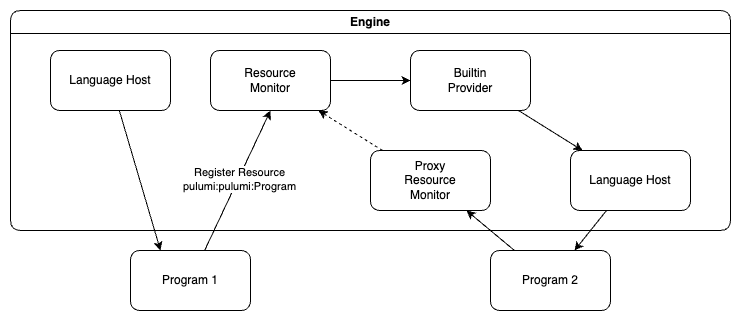

# Demo Repo for Running Nested Pulumi Programs

## Architecture

## Implementation Notes

1. Add a new token `pulumi:pulumi:Program`
    - This is implemented as a remote component.
2. Implement construct in the pu/pu builtin provider.
3. Fetch source using the `workspace.RetrieveTemplates` method
    - This supports local paths, named templates, Git and zip URLs.
4. Create a resource monitor client and register the `pulumi:pulumi:Program` to be our new root resource.
5. Start a new proxy monitor with the resource monitor client.
6. Resolve the project to run.
7. Construct the configuration from the inputs and the sub-program's defaults.
    - If there are unknowns, then just mark the whole output as unknown.
    - Maintain secret by marking the config as secrets if the input is secret.
8. Pass the construct dependencies to the monitor
9. Execute the sub-program against the proxy resource monitor.
10. Intercept the `pulumi:pulumi:Stack` register resource request and return the URN of the registered `pulumi:pulumi:Program` in its place.
11. Intercept all other register resource calls:
    1. Add all the component's dependencies to each resource.
    2. Prefix names with the Program component's name (unless opted-out)
    3. Set parent to the `pulumi:pulumi:Program` URN if unset.
    4. Register the modified resource with the original monitor
12. Intercept RegisterResourceOutputs for the `pulumi:pulumi:Program` URN:
    - Nest the outputs into a property called `outputs`.
    - Capture and return the outputs back to the Construct method.
13. Return the captured `pulumi:pulumi:Program` outputs within the ConstructResult.
